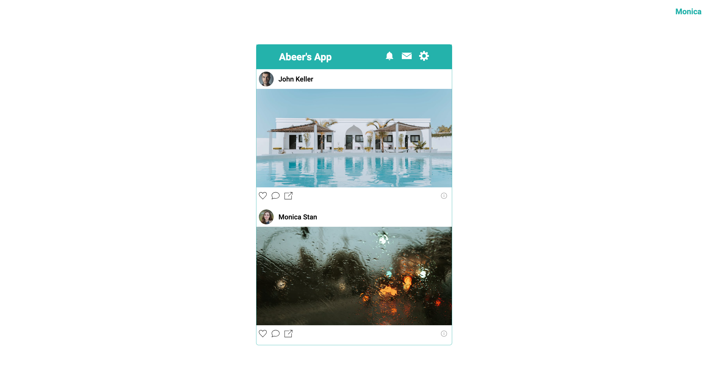
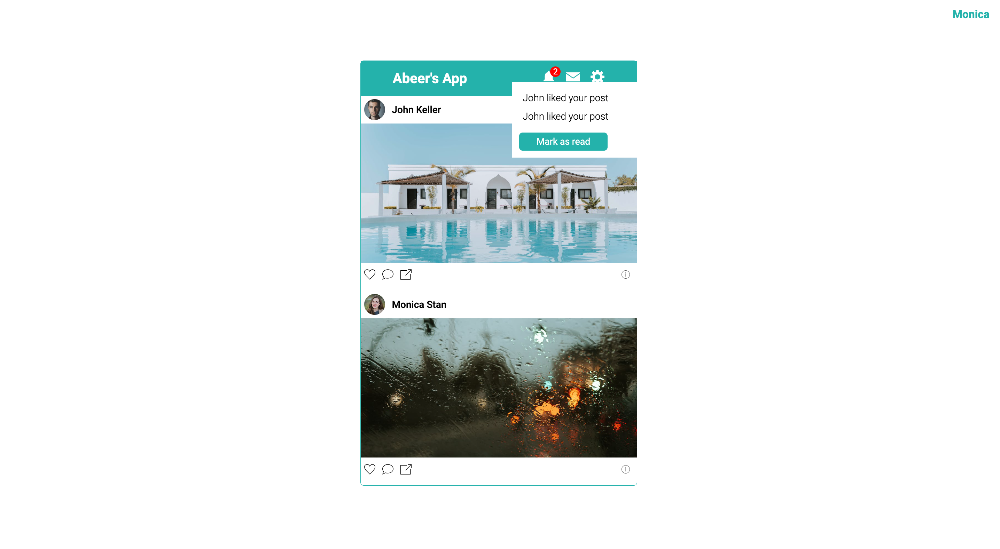

# Notifications App with Socket.IO

## Table of Contents
- [General Information](#general-information)
- [Technologies Used](#technologies-used)
- [Features](#features)
- [Screenshots](#screenshots)
- [Installation and Setup Instructions](#installation-and-setup-instructions)
- [Usage](#usage)
- [Project Status](#project-status)
- [Room for Improvement](#room-for-improvement)
- [Acknowledgements](#acknowledgements)
- [Contact](#contact)

## General Information
The Notifications App with Socket.IO is a simple real-time application that allows users to view static posts with dynamic like, share, and comment buttons. Leveraging Socket.IO, the app ensures instant updates and interactions between users.

### Purpose of this Project
This project serves as a demonstration of real-time features implemented using Socket.IO in a minimalistic notifications app.

## Technologies Used
- Node.js
- Express
- Socket.IO
- JavaScript
- HTML
- CSS

## Features
- Real-time updates for like, share, and comment actions
- Static posts with dynamic interactions
- Simple and intuitive user interface

## Screenshots

## Installation and Setup Instructions
To set up the Notifications App with Socket.IO on your local machine, follow these steps:

1. Clone this repository.
2. Ensure Node.js and npm are installed on your system.
3. Install server dependencies: `cd server && npm install`
4. Start the server: `cd server && npm start`
5. Visit the app at `http://localhost:3000/`

## Usage
### Interacting with Posts
- Click the "Like," "Share," or "Comment" buttons to see real-time updates.

## Project Status
The Notifications App with Socket.IO is currently in a completed state.

## Room for Improvement
- Enhance the user interface with more styling and features.
- Implement user authentication for personalized interactions.

## Acknowledgements
Special thanks to the developer community for Socket.IO.

## Contact
Created by Abeer Ahmed - [LinkedIn Profile](https://www.linkedin.com/in/abeerwebdev/) - Feel free to contact me for any inquiries or feedback.
